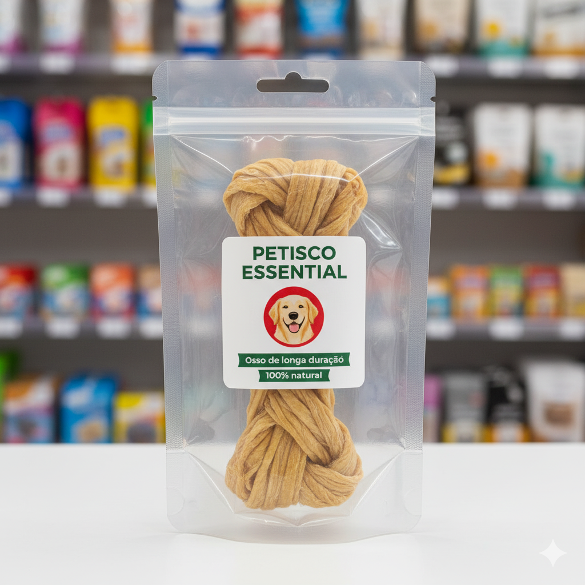
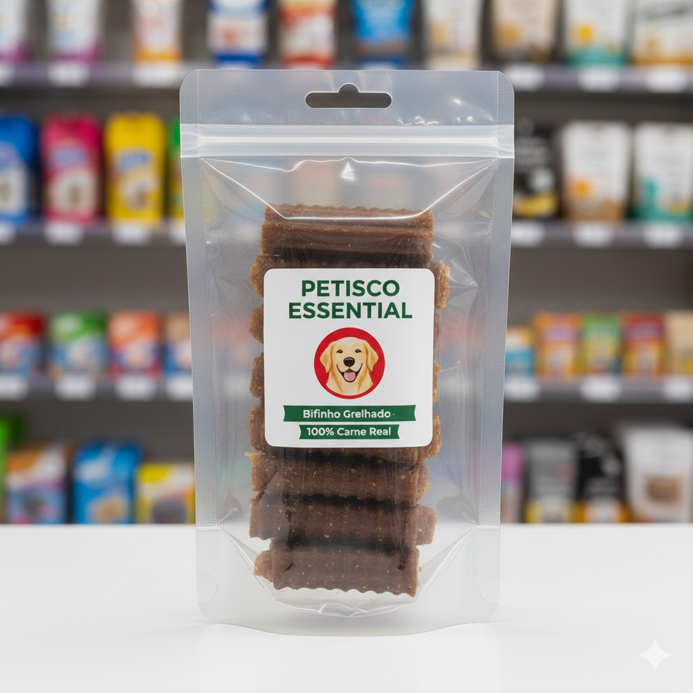
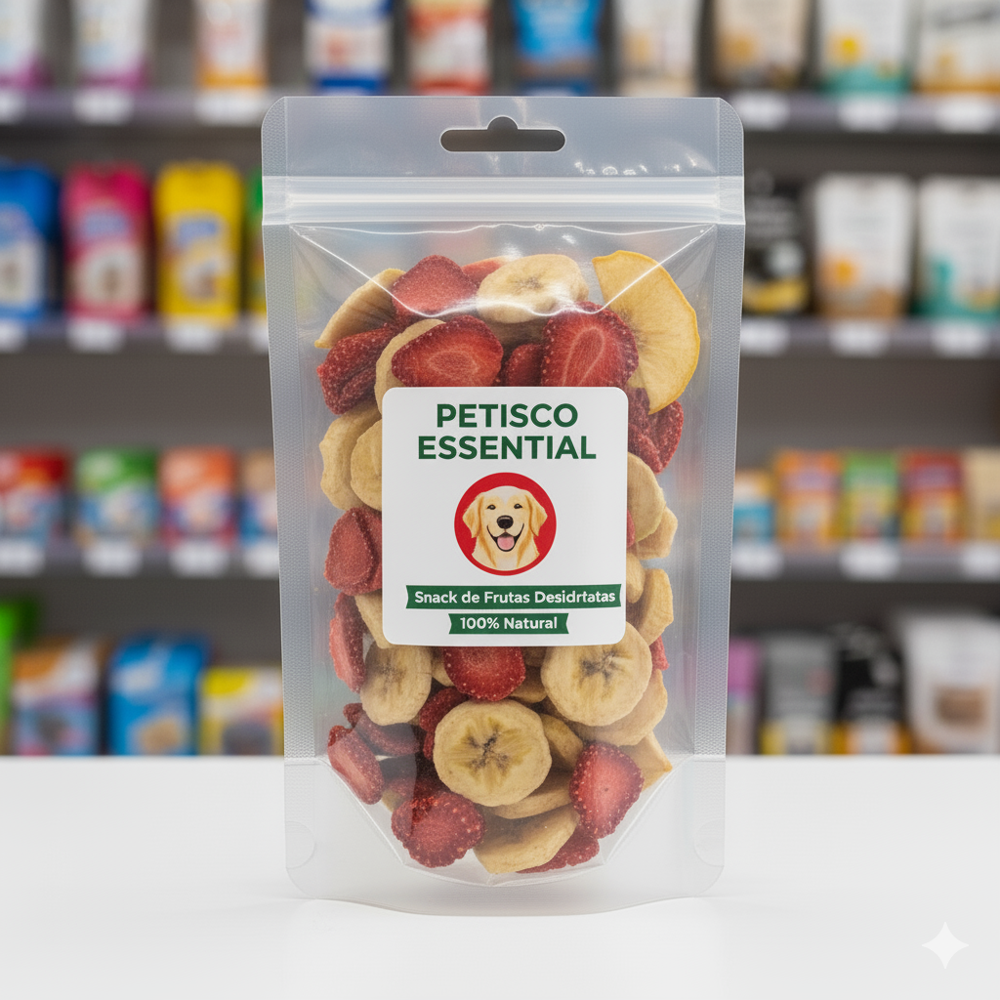
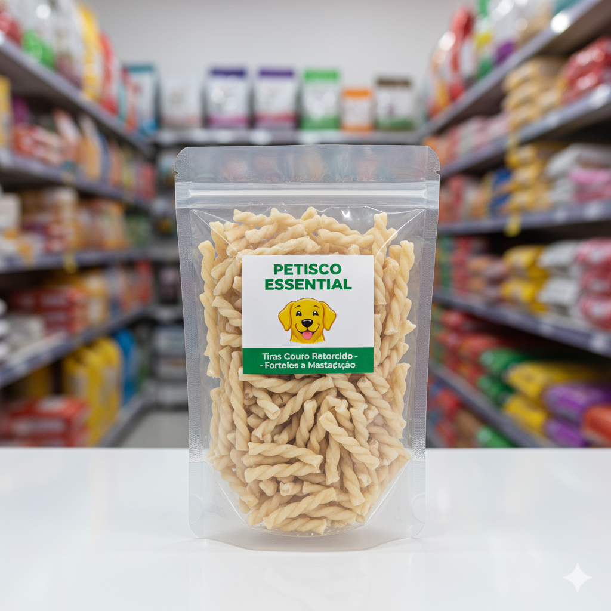
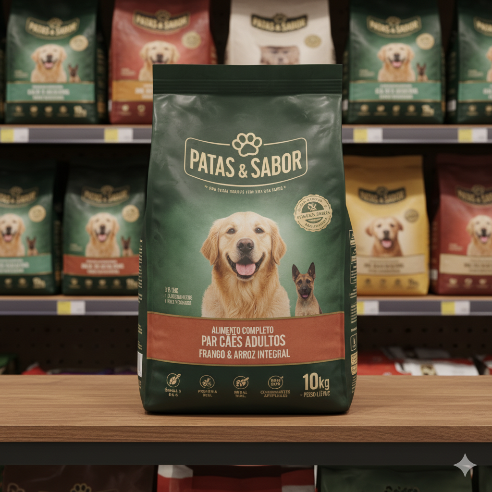
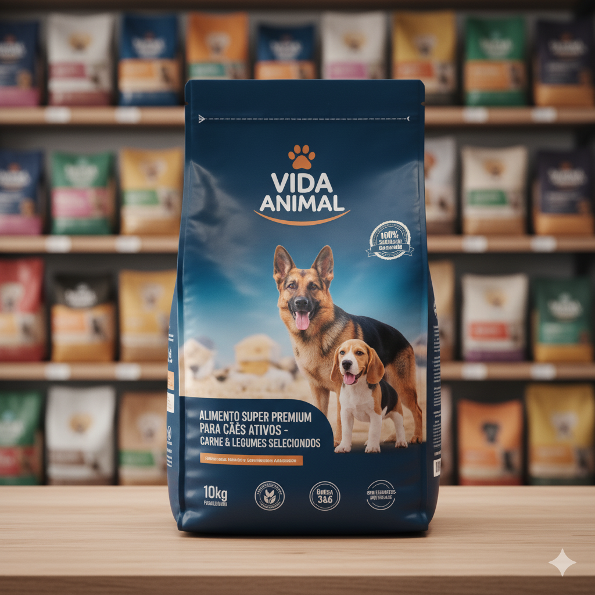
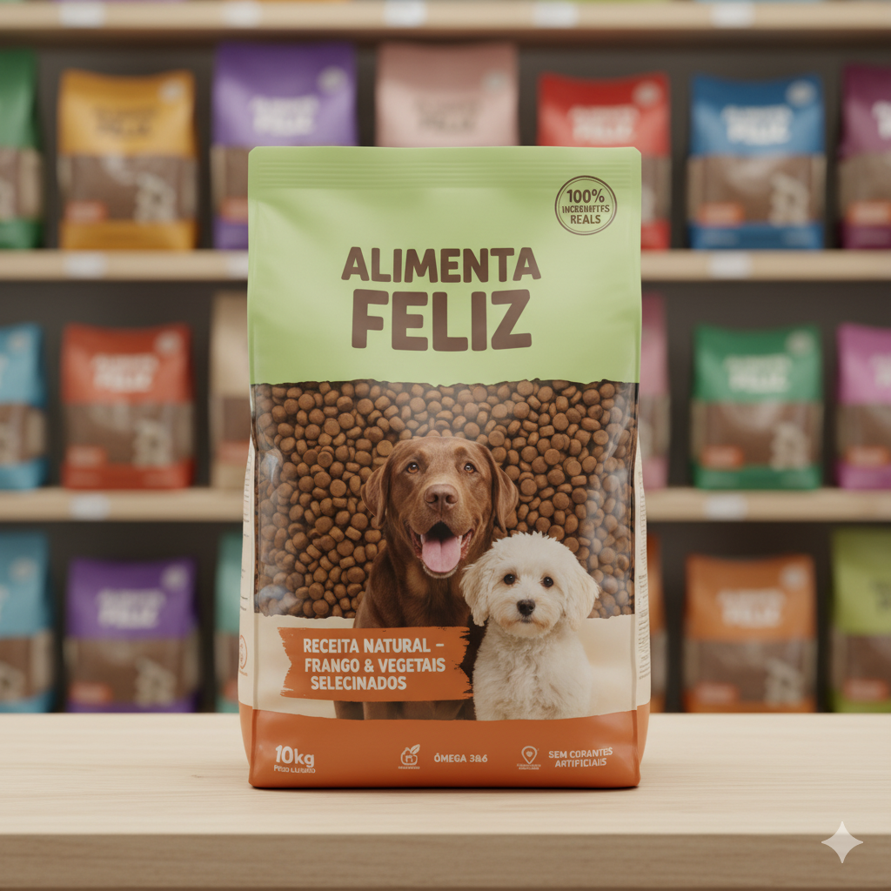

# LojaVirtual
Petshop:

<!DOCTYPE html>
<html lang="en">
<head>
    <meta charset="UTF-8">
    <meta name="viewport" content="width=device-width, initial-scale=1.0">
    <title>Loja Virtual</title>
</head>
<head>
  
</head>

<body>
    <title>Mini Petshop Virtual</title>
<body>
  <!-- Cabeçalho com Carrinho -->
  <header>
    

      
      0 <!-- Quantidade de produtos no carrinho -->
    

  </header>

  <!-- Título e Descrição -->
  <h1>Boutique Animal Online</h1> 
  
Selecione o produto que deseja comprar:
  

  <!-- Lista de Produtos -->
  

  
    <!-- Card de Produto -->
    

      
      <h3>Ossinho</h3>
      
Em estoque

      
Preço: R$ 25.90

      <button class="btn btn-success comprar-btn">Comprar</button>
    

    <!-- Card de Produto -->
    

      
      <h3>Petiscos de Carne</h3>
      
Em estoque

      
Preço: R$ 5.90

      <button class="btn btn-success comprar-btn">Comprar</button>
    

    <!-- Card de Produto -->
    

      
      <h3>Mix Saudável</h3>
      
Em estoque

      
Preço: R$ 6.00

      <button class="btn btn-success comprar-btn">Comprar</button>
    

    <!-- Card de Produto Fora de Estoque -->
    

      
      <h3>Palitos de Limpeza Dental</h3>
      
Fora de estoque

      
R$ 4,50

      <button disabled>Indisponível</button> <!-- Botão desabilitado -->
    

    

      
      <h3>Degustação de Ração</h3>
      
Em estoque

      
Preço: R$ 10.00

      <button class="btn btn-success comprar-btn">Comprar</button>
    

    

      
      <h3>Ração Premier</h3>
      
Em estoque

      
Preço: R$ 210.00

      <button class="btn btn-success comprar-btn">Comprar</button>
    

    

      
      <h3>Ração para Idosos</h3>
      
Em estoque

      
Preço: R$ 131.00

      <button class="btn btn-success comprar-btn">Comprar</button>
    

    

      
      <h3>Ração para Filhotes</h3>
      
Em estoque

      
Preço: R$ 124.60

      <button class="btn btn-success comprar-btn">Comprar</button>
    

  <!-- Modal do Carrinho -->
  

    
 <!-- ordem do modal-->
      

        <h2>Seu Carrinho</h2>
        &times;
      

      

 <!-- Produtos adicionados ao carrinho aparecerão aqui -->
      

        <h3>Total: R$ 0.00</h3>
        <button class="limpar-carrinho" onclick="limparCarrinho()">Limpar Carrinho</button>
        <button class="checkout-btn">Finalizar Compra</button>
      

    

  

  <!-- Script JavaScript -->

</body>
</html>
